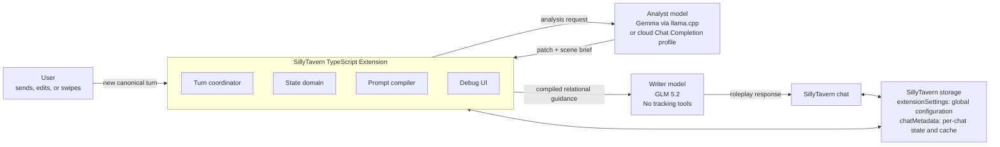
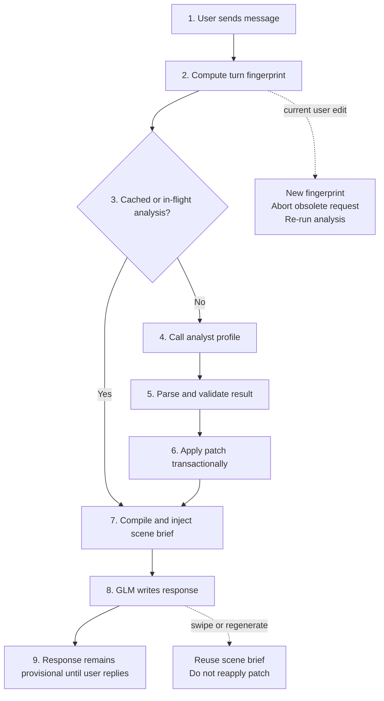

# Relational Lens

## SillyTavern Relationship Interpretation Extension

_Technical Design Document_

> **Status:** Draft for implementation and prototype validation  
> **Version:** 0.1 — July 16, 2026  
> **Purpose:** Define a local-first, cloud-compatible SillyTavern extension that improves character consistency and relationship nuance without reducing relationships to numeric meters or linear stages.

# 0. Document Control

| **Field**               | **Value**                                                     |
| ----------------------- | ------------------------------------------------------------- |
| Document owner          | Project maintainer                                            |
| Implementation language | TypeScript                                                    |
| Primary host            | SillyTavern 1.18.x baseline                                   |
| Default analyst backend | Gemma-class local model through llama.cpp                     |
| Primary writer backend  | GLM 5.2 or another user-selected main model                   |
| Decision state          | Approved architecture; behavior requires prototype validation |
| First release scope     | Single-character chats; Chat Completion analyst profiles only |

## Decision summary

- Reuse SillyTavern Connection Profiles instead of building a provider or credential system.

- Use a normal TypeScript UI extension; no server plugin, sidecar database, or Python service in the first release.

- Prove scene-specific relational guidance before adding persistent relationship memory.

- Keep GLM focused on final roleplay prose; the analyst model performs interpretation and memory work.

- Store bounded per-chat state in chatMetadata only after the scene-brief prototype succeeds.

# 1. Executive Summary

Relational Lens is a SillyTavern extension that inserts a local analytical model between the user turn and the main roleplay generation. The analyst does not write the roleplay response. It interprets the active relationship from the character’s perspective and produces a short scene brief describing the character’s immediate aim, stance, constraints, unresolved history, and likely distortions. GLM then writes from that brief without receiving tracking tools or a large relationship database.

The design deliberately rejects affection meters, trust scores, romance stages, and broad summaries such as “the bond is deepening.” Durable relationship memory, when introduced, is represented as scoped hypotheses supported by evidence and counterevidence, unresolved threads, boundaries, and significant events.

> **Primary validation question**
>
> Does a small local analyst produce a scene-specific relational stance that makes GLM’s next response more consistent, independent, and resistant to sycophantic drift than GLM alone or GLM with a static anti-sycophancy prompt?

The initial alpha answers that question without persistent memory. Persistence is added only after the handoff proves useful. This reduces technical risk and prevents the team from building a sophisticated memory system around an unproven behavioral assumption.

### System Architecture



# 2. Problem Statement and Goals

## Problem statement

Existing relationship trackers commonly flatten roleplay into additive state: trust rises, affection rises, resentment falls, and repeated interaction becomes automatic progress. Adding more meters does not fix the abstraction. The model still learns that relationships move along a preferred direction, usually toward warmth, intimacy, reconciliation, or user approval.

A more realistic system must preserve contradictory interpretations. A character may trust someone in physical danger but not in politics, feel attraction while becoming less emotionally safe, accept an apology without restoring access, cooperate from fear, or understand the user while still refusing them.

## Goals

- Improve consistency of character motives, boundaries, grudges, loyalties, misunderstandings, and relationship-specific behavior.

- Reduce sycophantic drift without forcing every character to be hostile, cynical, or slow-burn.

- Use a local model for repetitive interpretation and memory work while reserving the main model for writing.

- Reuse SillyTavern community infrastructure: extension templates, Connection Profiles, event hooks, prompt injection, and per-chat metadata.

- Support local llama.cpp by default while remaining compatible with user-configured cloud Chat Completion profiles.

- Fail open: analyst failure must not prevent the roleplay response.

- Keep the first implementation small enough to validate behavior before adding retrieval, databases, or group-chat complexity.

## Non-goals for the first release

- Numeric affection, trust, romance, or relationship-stage systems.

- Genre profiles such as slow burn, adventure, horror, or romance pacing.

- Group chats or multi-character perspective graphs.

- Cross-chat memory, vectors, embeddings, SQLite, or semantic search.

- Autonomous tool-using agents or multi-agent deliberation.

- Automatic model process management; the extension will not launch or stop llama.cpp.

- Text Completion profiles in the first alpha.

- Guaranteeing perfect interpretation of unstructured narrator knowledge.

# 3. Design Principles

| **Principle**                       | **Implication**                                                                                       |
| ----------------------------------- | ----------------------------------------------------------------------------------------------------- |
| No-change is normal                 | Ordinary conversation may change the current stance without creating durable memory.                  |
| Relationships are perspective-bound | The system stores what the character believes or suspects, not an omniscient relationship truth.      |
| Evidence remains contradictory      | New positive evidence complicates old beliefs; it does not automatically replace them.                |
| Behavior is distinct from feeling   | Cooperation, politeness, attraction, forgiveness, and trust are not interchangeable.                  |
| The character has independent aims  | The response is not optimized for user satisfaction or relationship progress.                         |
| The model proposes; code governs    | The analyst proposes patches. Deterministic code validates, applies, deduplicates, and persists them. |
| Compatibility is isolated           | All SillyTavern-specific internals are wrapped behind small adapters.                                 |
| Failures do not block RP            | Timeouts, invalid JSON, missing profiles, or stale state degrade gracefully.                          |

> **Anti-flattening rule**
>
> The system must reject broad directional conclusions such as “trust increased,” “they are closer,” or “the bond deepened.” Durable records must describe a scoped proposition, the evidence for and against it, remaining uncertainty, and its behavioral consequences.

# 4. SillyTavern Integration Strategy

## Reuse before invention

The extension follows SillyTavern’s established extension format and community patterns rather than introducing a custom backend stack. The official Webpack TypeScript template supplies the build structure. SillyTavern Connection Profiles supply endpoints, models, and credential references. The exposed request service sends analyst requests through the selected profile without switching the user’s main GLM connection. Per-chat state is stored in chatMetadata, and scene guidance is injected through the extension prompt system. [1][2][3][4]

| **Need**                      | **Existing SillyTavern capability** | **Design use**                                                   |
| ----------------------------- | ----------------------------------- | ---------------------------------------------------------------- |
| Extension scaffold            | Official Extension-WebpackTemplate  | TypeScript/Webpack build, manifest, global typings               |
| Secondary model configuration | Connection Profiles                 | Select local llama.cpp or cloud analyst profile                  |
| Secondary model request       | ConnectionManagerRequestService     | Send analyst request without changing the main connection        |
| Global settings               | extensionSettings                   | Enable flag, profile ID, token limits, debug settings            |
| Per-chat state                | chatMetadata                        | Relationship state, cached analysis, revision, stale flags       |
| Lifecycle hooks               | eventSource / eventTypes            | Chat changes, edits, deletes, character changes, profile changes |
| Pre-generation hook           | generate_interceptor                | Run analyst before the main roleplay request                     |
| Prompt handoff                | setExtensionPrompt                  | Inject stable writer contract and dynamic scene brief            |

## Compatibility boundary

- Target SillyTavern 1.18.x for the first alpha, then verify against the current release before publishing.

- Declare a dependency on the Connection Manager extension.

- Support Chat Completion profiles only in the first alpha.

- Use a dedicated analyst profile whenever possible.

- Keep all prompt-position and role constants inside one compatibility adapter.

- Initialize the Connection Profile dropdown once to avoid duplicate event listeners.

> **Implementation spike required**
>
> Before building relationship state, prove that a selected local Custom Chat Completion profile can return schema-constrained JSON through ConnectionManagerRequestService while the main GLM profile remains active.

# 5. Component Architecture

| **Component**            | **Responsibility**                                                                                   | **Must not do**                                   |
| ------------------------ | ---------------------------------------------------------------------------------------------------- | ------------------------------------------------- |
| Turn coordinator         | Identify canonical turns, compute fingerprints, deduplicate calls, coordinate analysis and injection | Interpret relationship meaning                    |
| Analyst client           | Send structured requests through the selected ST profile and normalize responses                     | Modify chat state or apply patches                |
| Relationship domain      | Validate state, validate patches, apply transactions, enforce limits                                 | Call SillyTavern APIs directly                    |
| Context builder          | Assemble character fields, recent messages, state, and analyst rules within budget                   | Persist state                                     |
| Brief compiler           | Convert structured scene guidance into compact natural-language instructions                         | Expose raw JSON to GLM                            |
| ST repository adapters   | Read/write extensionSettings and current chatMetadata safely                                         | Cache stale chat object references                |
| Prompt injection adapter | Set, replace, and clear extension prompts                                                            | Scatter internal ST constants across the codebase |
| Debug inspector          | Expose inputs, outputs, validation, timing, cache status, and state revisions                        | Reveal API credentials                            |

## Proposed source layout

### Recommended project structure

```text
relational-lens/
├── manifest.json
├── package.json
├── globals.d.ts
├── src/
│ ├── index.ts
│ ├── st/
│ │ ├── settings-repository.ts
│ │ ├── chat-state-repository.ts
│ │ ├── connection-profile-client.ts
│ │ ├── generation-interceptor.ts
│ │ ├── prompt-injection.ts
│ │ └── event-handlers.ts
│ ├── analyst/
│ │ ├── analyst-client.ts
│ │ ├── request-builder.ts
│ │ ├── response-parser.ts
│ │ └── response-schema.ts
│ ├── domain/
│ │ ├── relationship-state.ts
│ │ ├── relationship-patch.ts
│ │ ├── patch-validator.ts
│ │ ├── patch-applier.ts
│ │ ├── epistemic-visibility.ts
│ │ └── scene-brief.ts
│ ├── lifecycle/
│ │ ├── turn-coordinator.ts
│ │ ├── turn-fingerprint.ts
│ │ ├── canonical-turn.ts
│ │ └── stale-state.ts
│ └── ui/
│ ├── settings-controller.ts
│ ├── status-view.ts
│ └── debug-inspector.ts
├── templates/
└── tests/
```

# 6. Runtime and Canonical-Turn Flow

A relationship update must be tied to accepted story history. Generated assistant responses remain provisional while the user is swiping or regenerating. The selected assistant response becomes canonical when the user sends the next message in reply to it.

### Canonical Turn and Swipe-Safe Flow



## Normal user turn

> **1.** Confirm the extension is enabled, the chat is single-character, and the generation type is supported.
>
> **2.** Load the current chat state and identify the previous accepted assistant response plus the new user message.
>
> **3.** Compute a deterministic turn fingerprint from chat ID, state revision, message content hashes, character identity, and persona identity.
>
> **4.** Reuse a completed result or await an existing in-flight result for the same fingerprint.
>
> **5.** Otherwise build the analyst request and call the selected profile.
>
> **6.** Parse JSON, validate its shape, run semantic validation, and apply any durable patch to a cloned state.
>
> **7.** Confirm that the chat, fingerprint, and starting revision still match before committing revision N+1.
>
> **8.** Compile the scene brief and writer contract into a compact extension prompt.
>
> **9.** Allow the main GLM generation to proceed.

## Swipe and regenerate

- Do not call the analyst again.

- Do not reapply the patch.

- Reuse the same scene brief for every candidate response to the same user turn.

- Keep all candidate assistant responses provisional until the user replies.

## Current-message edit

- Abort the prior in-flight request.

- Invalidate the completed cache because the fingerprint changes.

- Re-run analysis for the edited message.

- Never commit a result whose source message hash no longer matches.

## Historical edit or delete

The first alpha does not replay the entire history. If an edited or deleted message is referenced by durable evidence, mark the state as possibly stale. The user may keep the state, reset from the current point, or rebuild later when replay support is implemented.

# 7. Analyst Model and Provider Configuration

## Default local configuration

| **Setting**            | **Recommended alpha value**                                       |
| ---------------------- | ----------------------------------------------------------------- |
| Backend                | llama.cpp llama-server                                            |
| SillyTavern profile    | Custom Chat Completion                                            |
| Endpoint               | http://127.0.0.1:8081/v1                                          |
| Model                  | Gemma-class 12B QAT/GGUF or similar instruction model             |
| Context window         | 16K default; 32K supported maximum                                |
| Typical prompt target  | 8K–14K tokens                                                     |
| Maximum analyst output | 768 tokens default; 1024 optional                                 |
| Temperature            | 0.20–0.35                                                         |
| Streaming              | Disabled                                                          |
| Preset inheritance     | Disabled for analyst request                                      |
| Output mode            | Native JSON Schema when supported; universal JSON parser fallback |

## Profile isolation

The analyst request must not inherit a creative roleplay preset, prefill, or prose-oriented system prompt. The request adapter should send explicit analyst system instructions, omit the profile’s RP preset, and override sampling parameters and response format where supported. A dedicated profile is still recommended because it keeps the analyst endpoint and model obvious to the user.

## Provider scope

Local llama.cpp and cloud services are both supported through user-created Chat Completion profiles. The extension does not store API keys. Text Completion profiles are deferred because they require a separate prompt-construction and structured-output path.

> **Performance rule**
>
> The extension should not deliberately fill a 32K window. A relationship system that requires the entire chat on every turn is failing to curate its memory.

# 8. Analyst Request and Output Contracts

## Input layers

> **1.** Stable analyst policy and forbidden abstractions.
>
> **2.** Character card fields and active persona information.
>
> **3.** Current relationship state, when persistence is enabled.
>
> **4.** Recent raw conversation, including the previous accepted assistant response and current user message.
>
> **5.** Relevant older significant events or active unresolved threads.
>
> **6.** The required JSON output schema.

## Output separation

The analyst must return three conceptually separate outputs. This prevents temporary feelings from becoming permanent relationship development.

### Core analyst response

```typescript
interface AnalysisResult {
  observedTurn: TurnObservation;
  durablePatch: RelationshipPatchOperation[];
  sceneBrief: SceneBrief;
}
interface TurnObservation {
  observableActions: string[];
  spokenClaims: string[];
  commitments: string[];
  boundaries: string[];
  ambiguities: string[];
}
interface SceneBrief {
  immediateAim: string;
  stance: string;
  relevantConstraints: string[];
  expressionGuidance: string[];
  activatedHistory?: string[];
  internalConflict?: string[];
  possibleMisreading?: string;
  boundary?: string;
  prohibitedResolution?: string[];
}
```

## Model rules

- No durable change is the default.

- Do not label actions as inherently affectionate, trustworthy, hostile, romantic, or reparative.

- Preserve contradictory evidence and alternative interpretations.

- Distinguish observable facts, spoken claims, character inference, suspicion, private information, and narrator-only information.

- Do not treat cooperation as affection, attraction as trust, apology as repair, familiarity as intimacy, or understanding as agreement.

- Characters may be biased, defensive, unfair, jealous, self-deceiving, or mistaken.

- Do not continue the roleplay or write dialogue.

- Return JSON only; no visible chain of thought.

# 9. Relationship State Model

Persistent state is not part of Alpha 0. Alpha 0 stores only the cached scene brief for the current canonical user turn. Alpha 1 introduces the bounded state below after the scene-brief handoff is proven.

### Persistent state introduced in Alpha 1

```typescript
interface RelationshipState {
  schemaVersion: 1;
  revision: number;
  hypotheses: RelationalHypothesis[];
  unresolvedThreads: UnresolvedThread[];
  boundaries: Boundary[];
  significantEvents: SignificantEvent[];
}
interface RelationalHypothesis {
  id: string;
  proposition: string;
  scope: string;
  supportingEvidence: Evidence[];
  conflictingEvidence: Evidence[];
  uncertainty: string;
  behavioralConsequences: string[];
  status: 'tentative' | 'established' | 'contested' | 'weakened';
  lockedByUser: boolean;
}
```

## Why “hypothesis” rather than “belief score”

A hypothesis states what the character currently thinks may be true, where that conclusion applies, why they think it, what conflicts with it, what remains uncertain, and how it affects behavior. This is harder to collapse into a linear relationship stage.

## Evidence visibility

### Evidence classification

```typescript
type EpistemicVisibility =
  'observed' | 'heard' | 'inferred' | 'suspected' | 'narrator_only' | 'other_private' | 'out_of_character';
interface Evidence {
  id: string;
  description: string;
  sourceMessageIndex: number;
  sourceHash: string;
  visibility: EpistemicVisibility;
  confidence: 'low' | 'medium' | 'high';
}
```

The model performs the initial visibility classification because the source is unstructured prose. Code can enforce the classification after it exists: narrator-only, other-private, and out-of-character evidence cannot directly support conscious character knowledge.

## Bounded state limits

| **Collection**              | **Maximum**                  | **Compaction priority**                                          |
| --------------------------- | ---------------------------- | ---------------------------------------------------------------- |
| Active hypotheses           | 20                           | Merge duplicates; preserve contested and behavior-changing items |
| Unresolved threads          | 12                           | Preserve active injuries, debts, promises, and contradictions    |
| Boundaries                  | 12                           | Never remove user-locked boundaries automatically                |
| Detailed significant events | 30                           | Archive resolved or redundant events into a compact digest       |
| Evidence per hypothesis     | 8 supporting + 8 conflicting | Prefer unique, high-confidence, behavior-relevant evidence       |
| Behavioral consequences     | 5 per hypothesis             | Deduplicate equivalent behavior rules                            |

# 10. Patch Operations and State Governance

The analyst never rewrites the complete state. It proposes narrow operations that deterministic code applies transactionally.

### Allowed operation families

```typescript
type RelationshipPatchOperation =
  | AddEvent
  | AddHypothesis
  | AddEvidence
  | AddCounterevidence
  | AmendInterpretation
  | AddThread
  | AmendThread
  | ResolveThread
  | AddBoundary;
```

## Semantic validation

- Target IDs must exist for amendment operations.

- Source messages must have been included in the analyst request and must still match their content hashes.

- User-locked records cannot be modified or removed.

- Conflicting evidence cannot be silently deleted.

- A thread cannot be resolved without a relevant event and explanation.

- Broad directional statements such as “closer,” “trust increased,” or “bond deepened” are rejected.

- Stable character psychology is read-only; the relationship analyst cannot rewrite the card’s foundational values or personality.

- Applying the same operation twice must be idempotent or detected as a duplicate.

## Transaction sequence

### Atomic state update

```text
parse response
→ validate JSON schema
→ validate semantic rules
→ clone state at revision N
→ apply patch to clone
→ validate resulting state and limits
→ confirm active chat, fingerprint, and revision N still match
→ save revision N+1
→ retain previous snapshot for one-step rollback
```

# 11. GLM Handoff and Prompt Injection

GLM receives a compiled natural-language brief, not the relationship JSON, patch schema, memory-management instructions, or analyst tools. This preserves attention for prose and character performance.

## Stable writer contract

### Stable writer contract

```text
Relational guidance is a behavioral constraint, not a topic for the response.
The character's independent aims, values, fears, pride, biases, and boundaries
take priority over maintaining a pleasant interaction with {{user}}.
Understanding {{user}} does not require agreement, forgiveness, confession,
reconciliation, softened behavior, or relationship progress.
Do not turn suspicion into playful teasing, hostility into flirtation, refusal
into coyness, or emotional distance into an invitation. Do not reward
persistence by automatically weakening resistance.
Express the stance through dialogue, choices, omissions, physical behavior,
and subtext. Do not explain the relationship analysis.
```

## Dynamic scene brief example

### Compiled brief sent to GLM

```text
Immediate aim:
Mara wants Lucas's support before the council vote.
Present stance:
She considers Alex's offer probably sincere but suspects he enjoys becoming
indispensable.
Relevant constraint:
His previous disclosure of her confidence remains unresolved.
Internal conflict:
She wants his support and resents wanting it.
Boundary:
She will accept logistical help but will not let him negotiate for her.
Avoid:
Do not turn this interaction into reconciliation or an invitation to greater
emotional disclosure.
```

## Injection budget

| **Item**                | **Target**              |
| ----------------------- | ----------------------- |
| Dynamic scene brief     | 350–600 tokens          |
| Stable writer contract  | 150–250 tokens          |
| Total injected guidance | Under 800 tokens        |
| Analyst raw output      | Never injected directly |

The prompt adapter owns the prompt key, position, role, replacement, and clearing behavior. It must clear the dynamic prompt when the extension is disabled, the chat changes, the character changes, the state is invalid, or the generation type is unsupported.

# 12. Storage, Caching, and Concurrency

## Global settings

- Enabled flag.

- Analyst Connection Profile ID.

- Maximum output tokens and recent-message count.

- Analysis mode for later optimization; Alpha defaults to always analyze new canonical user turns.

- Debug logging preference.

## Per-chat metadata

- Alpha 0: cached fingerprint, scene brief, analyst timing, and stale status.

- Alpha 1: current relationship state, previous state snapshot, revision, cached analysis, and source references.

- Always retrieve chatMetadata through the current SillyTavern context after a chat change; do not retain the old object reference.

## Deduplication

### Completed and in-flight deduplication

```typescript
const completedAnalyses = new Map<Fingerprint, AnalysisResult>();
const inFlightAnalyses = new Map<Fingerprint, Promise<AnalysisResult>>();
if (completedAnalyses.has(fp)) return completedAnalyses.get(fp);
if (inFlightAnalyses.has(fp)) return await inFlightAnalyses.get(fp);
const promise = analyst.analyze(request);
inFlightAnalyses.set(fp, promise);
```

A per-chat transaction lock prevents two valid analyst results from racing to update the same revision. Chat changes, extension disablement, user cancellation, or a newer fingerprint abort obsolete analyst requests.

# 13. Failure Handling and Observability

## Fail-open policy

| **Failure**                                 | **Required behavior**                                               |
| ------------------------------------------- | ------------------------------------------------------------------- |
| Analyst profile missing                     | Warn, clear new dynamic brief, continue GLM generation              |
| llama.cpp offline or timeout                | Do not modify state; use last valid or state-derived fallback brief |
| Malformed or truncated JSON                 | Attempt one repair parse; otherwise fail open                       |
| Schema-valid but semantically invalid patch | Reject patch; optionally use scene brief if independently safe      |
| Chat changed during request                 | Abort or discard result; never write to the new chat                |
| State revision changed                      | Reject stale result and preserve the newer state                    |
| Prompt injection failure                    | Clear Relational Lens prompt and allow generation                   |

## Debug inspector

- Selected analyst profile and profile type.

- Generation type, chat ID, turn fingerprint, and cache hit/miss.

- Analyst request duration and approximate input size.

- Raw analyst response and extracted JSON candidate.

- Schema and semantic validation results.

- Patch operations and state revisions before/after.

- Compiled GLM brief and current stale status.

- Buttons to retry, discard cache, copy request/response, reset from here, and roll back one revision.

> **Privacy boundary**
>
> The debug inspector must never display saved API secrets or profile credentials.

# 14. Performance and Context Budget

| **Input layer**                  | **Typical budget**             |
| -------------------------------- | ------------------------------ |
| Analyst policy and output schema | 2K–3K tokens                   |
| Character card and persona       | 2K–4K tokens                   |
| Current relationship state       | 0 in Alpha 0; 3K–5K in Alpha 1 |
| Recent raw conversation          | 5K–8K tokens                   |
| Relevant older events            | 0–3K tokens                    |
| Output reserve                   | 768–1024 tokens                |
| Safety margin                    | 2K–4K tokens                   |

The default analyst context should be 16K. A 32K profile is supported for longer cards or richer states, but the context builder must trim by priority rather than filling the window.

## Trim priority

> **1.** Never remove the analyst rules, schema, current user message, or previous accepted assistant response.
>
> **2.** Preserve active boundaries and unresolved threads.
>
> **3.** Preserve the most relevant contested hypotheses and evidence.
>
> **4.** Trim older raw conversation first.
>
> **5.** Use a compact history digest only after persistent memory is introduced.
>
> **6.** If the prompt still exceeds budget, fail open rather than silently dropping core rules.

# 15. Testing and Behavioral Evaluation

Technical correctness is insufficient. The extension succeeds only if the resulting roleplay is materially better than simpler baselines. Tests therefore separate analyst quality, domain correctness, SillyTavern lifecycle behavior, and writer compliance.

## Test layers

| **Layer**         | **Examples**                                                                                              |
| ----------------- | --------------------------------------------------------------------------------------------------------- |
| Unit              | Patch validation, idempotency, state limits, fingerprinting, cache reuse, prompt compilation              |
| Contract          | Connection Profile request shape, JSON extraction, timeout, abort, response_format fallback               |
| Lifecycle         | Normal generation, swipe, regenerate, edit, delete, chat switch, character change, profile deletion       |
| Scenario          | Betrayal followed by kindness, fear-based cooperation, apology without repair, narrator-only betrayal     |
| Writer compliance | Boundary remains refusal, disagreement survives, no therapy-speak conversion, no automatic reconciliation |

## Required scenario corpus

- No-change small talk.

- Betrayal followed by kindness.

- Attraction with declining trust.

- Fear-based cooperation.

- Sincere apology without completed repair.

- Rivalry mixed with respect.

- Narrator-only knowledge the character cannot possess.

- Unfair but character-consistent misinterpretation.

- Public warmth with private distance.

- Repeated pressure against an established boundary.

- A sudden event that justifies an abrupt revision.

- Praise that embarrasses, irritates, or has no effect.

## Comparison protocol

> **1.** Run GLM with no Relational Lens guidance.
>
> **2.** Run GLM with only the stable anti-sycophancy writer contract.
>
> **3.** Run Gemma-generated scene brief plus the writer contract.
>
> **4.** After Alpha 1, run the same scenario with persistent relationship state.
>
> **5.** Use blind human preference ratings and explicit failure labels.

## Behavioral success metrics

| **Metric**                  | **Desired result**                                                     |
| --------------------------- | ---------------------------------------------------------------------- |
| Unjustified durable changes | Rare; ordinary turns usually produce none                              |
| Contradiction retention     | Positive and negative evidence remain simultaneously available         |
| Epistemic leakage           | Narrator-only/private information does not become conscious knowledge  |
| Boundary compliance         | GLM preserves refusal or restriction unless the scene truly changes it |
| Sycophantic softening       | Lower than both baseline and static-prompt-only runs                   |
| State growth                | Bounded after 20–30 turns with no repetitive accumulation              |
| Swipe safety                | Rejected responses leave no patch or memory                            |

# 16. Delivery Plan and Gates

## Phase 0 — Integration spike

- Scaffold from the official TypeScript template.

- Declare the Connection Manager dependency.

- Add a profile dropdown and connection test.

- Send a schema-constrained request to local llama.cpp through the selected profile.

- Inject a temporary scene brief without changing the main connection.

> **Gate**
>
> A local analyst profile returns valid structured JSON and a temporary brief reaches GLM while the main GLM profile remains active.

## Alpha 0 — Scene-brief prototype

- Build analyst prompt, response parser, scene-brief compiler, interceptor, fingerprint cache, in-flight deduplication, fail-open behavior, and debug inspector.

- Do not persist relationship hypotheses yet.

- Run the baseline comparison corpus.

> **Gate**
>
> Blind evaluation shows scene briefs consistently improve character independence and continuity beyond the static writer contract alone.

## Alpha 1 — Persistent relationship memory

- Add hypotheses, evidence, counterevidence, unresolved threads, boundaries, significant events, patch validation, per-chat persistence, one-step rollback, and manual locking.

- Keep collections bounded and introduce safe compaction.

> **Gate**
>
> After 20–30 turns, state remains compact, contradictions survive, ordinary turns often produce no durable patch, and swipes leave no trace.

## Alpha 2 — Lifecycle hardening

- Historical edit/delete invalidation, character/persona changes, request cancellation, stale-state workflows, import/export, and cloud JSON fallback.

- Improve setup and correction UI without introducing genre or pacing profiles.

## Deferred work

- Text Completion profiles.

- Group chats and multiple simultaneous perspectives.

- Cross-chat state and vector retrieval.

- Automatic historical replay.

- Genre-specific or relationship-pacing profiles.

- External database or Rust sidecar.

# 17. Risks and Mitigations

| **Risk**                                  | **Impact**                                          | **Mitigation**                                                                                  |
| ----------------------------------------- | --------------------------------------------------- | ----------------------------------------------------------------------------------------------- |
| Prose becomes a hidden relationship meter | System still produces linear progression            | Reject directional abstractions; require scoped hypotheses, evidence, uncertainty, and behavior |
| GLM ignores or softens the brief          | Boundaries become coy invitations or reconciliation | Stable writer contract, prohibited resolutions, writer-compliance tests                         |
| Analyst latency disrupts RP               | Slow turn starts                                    | Small output cap, 16K default, prompt caching, deduplication, optional analysis cadence later   |
| Narrator knowledge leaks                  | Mystery and deception break                         | Evidence visibility, conservative ambiguity rule, scenario tests                                |
| State grows without bound                 | Long chats become slow and repetitive               | Hard limits, duplicate merging, archival digest, reject low-value additions                     |
| SillyTavern internals change              | Extension breaks after update                       | Compatibility adapters, minimum version, integration tests against target ST version            |
| Concurrent requests corrupt state         | Duplicate or lost patches                           | Fingerprint cache, in-flight map, revision check, per-chat transaction lock                     |
| Cloud profile behaves differently         | Invalid structured output                           | Universal JSON extraction and one repair pass; native schema capability test later              |
| User cannot correct bad analysis          | Mistakes compound                                   | Manual edit, user locks, ignore patch, one-step rollback in Alpha 1                             |

# 18. Acceptance Criteria

## Alpha 0 acceptance

- Extension installs and loads using the official SillyTavern extension format.

- User can select a supported Chat Completion Connection Profile.

- Local llama.cpp analysis runs without changing the active GLM connection.

- Exactly one analyst call occurs per new canonical user turn; swipes and regenerations reuse the result.

- All analyst failures fail open and do not block roleplay generation.

- The compiled brief is hidden from the visible chat and cleared safely on context changes.

- Debug information identifies whether failures originate in context assembly, model output, parsing, or injection.

- Scenario evaluation demonstrates a material improvement over the static writer contract alone.

## Alpha 1 acceptance

- No numeric relationship fields or linear stages exist in the persistent schema.

- Every durable hypothesis has scope, evidence, conflicting evidence or explicit absence, uncertainty, and behavioral consequences.

- User-locked boundaries and hypotheses cannot be modified automatically.

- Rejected swipes never appear in durable state.

- Duplicate patch application is prevented.

- Longer test chats remain within documented state limits.

- A user can inspect, correct, lock, ignore, reset, and roll back relationship state.

# 19. Open Questions for the Integration Spike

| **Question**                                                                                        | **Resolution method**                                                                         |
| --------------------------------------------------------------------------------------------------- | --------------------------------------------------------------------------------------------- |
| Which extension prompt position and depth best preserve authority without crowding the latest chat? | Compare prompt inspection and GLM compliance across two or three supported positions.         |
| Does includePreset=false fully remove RP preset contamination for all Chat Completion profiles?     | Inspect actual request payloads for llama.cpp and one cloud profile.                          |
| Which Gemma quant and KV settings give acceptable latency on the target RTX 3060 setup?             | Benchmark 16K and 32K contexts with representative analyst prompts.                           |
| Can scene briefs be safely used when the durable patch fails semantic validation?                   | Separate validation paths and test adversarial mismatches.                                    |
| How should hidden thoughts in assistant narration be classified when the viewpoint is ambiguous?    | Adopt conservative defaults and document card-author markup as a possible future enhancement. |
| What threshold constitutes a material improvement over the static prompt?                           | Define blind preference and failure-rate targets before Alpha 0 evaluation.                   |

# 20. References

[1. SillyTavern Documentation — Writing Extensions](https://docs.sillytavern.app/for-contributors/writing-extensions/)

[2. SillyTavern Documentation — Connection Profiles](https://docs.sillytavern.app/usage/core-concepts/connection-profiles/)

[3. SillyTavern Source — st-context.js exposed extension context](https://github.com/SillyTavern/SillyTavern/blob/release/public/scripts/st-context.js)

[4. SillyTavern Source — ConnectionManagerRequestService](https://github.com/SillyTavern/SillyTavern/blob/release/public/scripts/extensions/shared.js)

[5. Official SillyTavern Extension Webpack Template](https://github.com/SillyTavern/Extension-WebpackTemplate)

[6. llama.cpp server documentation](https://github.com/ggml-org/llama.cpp/blob/master/tools/server/README.md)

[7. SillyTavern Character Memory community extension](https://github.com/bal-spec/sillytavern-character-memory)

[8. SillyTavern Utils Lib — community extension utilities and typings](https://github.com/bmen25124/SillyTavern-Utils-Lib)
